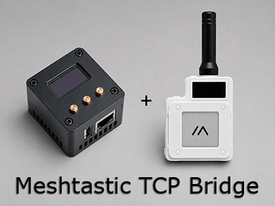

## Version

Current public release: **0.1.0**

<p align="left">
  
</p>

# meshtastic-tcp-bridge

A reconnect-safe TCP bridge for using USB/Serial Meshtastic nodes with the Android Meshtastic app over a trusted LAN.

## Purpose

The Android Meshtastic app can connect to network/TCP devices, but many stable attic, roof, or gateway nodes are USB-only. A simple `socat` bridge can get stuck after phone Wi-Fi roaming because a stale TCP session may keep the serial port busy.

`meshtastic-tcp-bridge` exposes a USB serial Meshtastic device on TCP port `4403` and keeps only one active TCP client. When a new client connects, the bridge closes the old client immediately, which lets the Android app recover from stale connections without restarting the service.

```text
Android Meshtastic App
  -> Wi-Fi/LAN TCP 4403
  -> Linux box
  -> USB serial
  -> Meshtastic node
```

## Supported

- Linux with systemd
- USB serial Meshtastic devices
- `/dev/serial/by-id/*`
- `/dev/ttyACM*`
- `/dev/ttyUSB*`

Common examples include LilyGO T-Echo, Heltec LoRa 32 V2, T-Beam, RAK/WisBlock devices over USB serial, ESP32 boards with CP210x/CH340/CDC ACM, and similar Meshtastic USB serial devices.

## Limitations

- One active TCP client at a time.
- New TCP clients replace old/stale clients.
- No authentication; expose only on a trusted LAN or VPN.
- Not a web UI.
- Not a Meshtastic protocol parser.
- Not for BLE-only devices unless they expose serial over USB.
- Wi-Fi Meshtastic nodes usually do not need this bridge.

## Install

```bash
git clone https://github.com/Zavodiy/meshtastic-tcp-bridge.git
cd meshtastic-tcp-bridge
sudo ./install.sh
```

The installer detects common serial device paths, creates `/etc/meshtastic-tcp-bridge.env`, installs the app into `/opt/meshtastic-tcp-bridge`, creates a dedicated `meshtastic-tcp-bridge` system user, and starts the systemd service.

Non-interactive example:

```bash
sudo ./install.sh --serial-port /dev/serial/by-id/your-meshtastic-device --tcp-port 4403
```

Then configure the Android app to use:

- Host: the Linux box IP address
- Port: `4403`

## Configuration

Runtime configuration lives in:

```text
/etc/meshtastic-tcp-bridge.env
```

Example:

```ini
MESHTASTIC_SERIAL_PORT=/dev/serial/by-id/your-meshtastic-device
MESHTASTIC_TCP_HOST=0.0.0.0
MESHTASTIC_TCP_PORT=4403
MESHTASTIC_BAUD=115200
MESHTASTIC_CLIENT_IDLE_TIMEOUT=120
MESHTASTIC_LOG_LEVEL=INFO
```

Prefer `/dev/serial/by-id/...` when available because it is more stable than `/dev/ttyACM0` or `/dev/ttyUSB0`.

## Commands

```bash
sudo systemctl status meshtastic-tcp-bridge --no-pager
sudo journalctl -u meshtastic-tcp-bridge -f
sudo systemctl restart meshtastic-tcp-bridge
sudo nano /etc/meshtastic-tcp-bridge.env
sudo systemctl restart meshtastic-tcp-bridge
```

## Documentation

- [Android setup](docs/android.md)
- [Configuration](docs/configuration.md)
- [Troubleshooting](docs/troubleshooting.md)
- [Legacy socat notes](docs/legacy-socat.md)

## License

MIT
